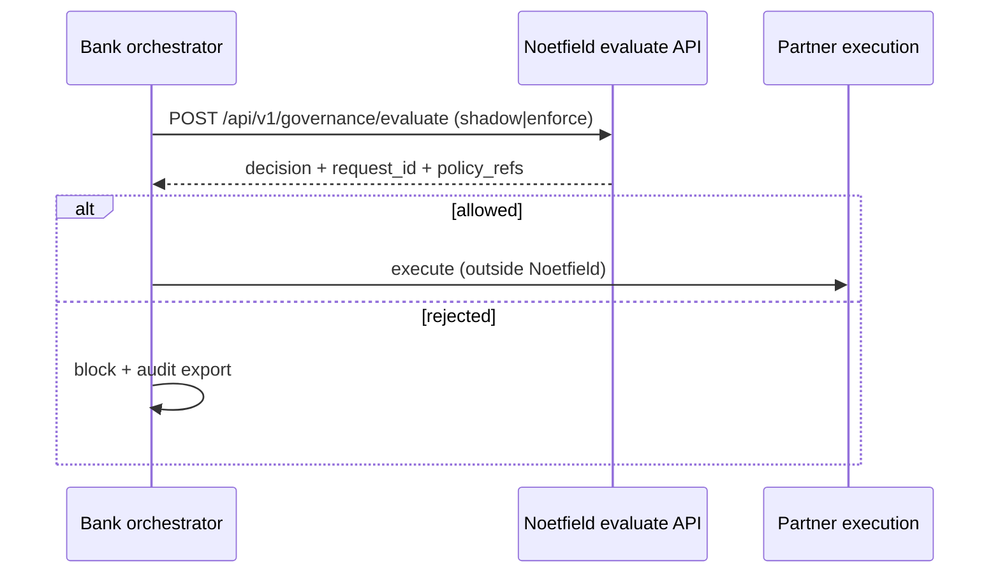
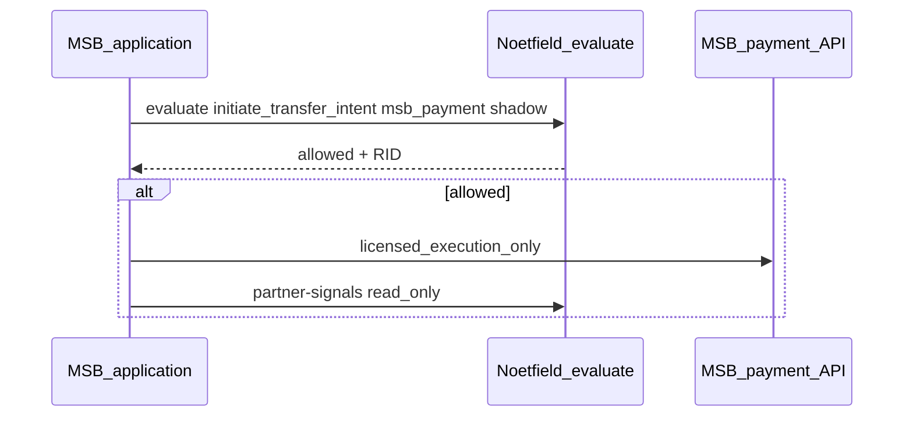

<!-- ADVISOR_ARCHITECT_CHECKLIST_STUB (auto-inserted) -->
Advisor / Architect Minimal Checklist (AUTO-STUB)
-----------------------------------------------

- protects: Which founder goal does this protect? (pick one)
- sina_workload: reduces / increases + short rationale
- permission_loop: yes / no + explanation
- sandbox_autonomy: yes / no + where/how (sandbox lane path)
- target_to_blocker: yes / no + mitigation
- canon_version: (string)
- sandbox_evidence: link(s) to sandbox receipt(s)

# Partner pre-execution integration (design)

## Pattern

Accredited integrators and bank PSPs call **Noetfield evaluate** before their own execution layer:



## Webhook: `governance.decision.recorded`

When `GOVERNANCE_WEBHOOK_URLS` is set, each evaluate emits:

```json
{
  "event": "governance.decision.recorded",
  "data": {
    "request_id": "RID-…",
    "correlation_id": "bank-run-123",
    "tenant_id": "…",
    "decision": "REJECT",
    "allowed": false,
    "reason_code": "…",
    "policy_refs": ["…"],
    "mode": "shadow"
  }
}
```

- **No PII** in the default payload.
- Optional **HMAC** via `GOVERNANCE_WEBHOOK_SECRET` → header `X-Noetfield-Signature: sha256=…`.

## Licensed MSB / PSP pattern

MSBs and RPAA-supervised PSPs call evaluate **before** their own payment or remittance APIs. Noetfield never places orders or holds funds.



- Preset: `GET /api/v1/governance/scenario-presets/msb`
- Guide: [MSB_STAGING_INTEGRATION.md](../MSB_STAGING_INTEGRATION.md)
- Intake: `vector=partner-msb`

## SIEM / GRC

Map `reason_code` and `policy_refs` to your ITSM, GRC, or SIEM tools using `request_id` as the correlation key shared with intake (`POST /api/intake`) and ops email.

## Enterprise tier (deferred in code)

- mTLS client certificates per tenant
- Per-tenant policy packs with Postgres RLS
- Signed webhook replay protection

Track engineering work in GitHub Issues (`engineering`), not public root trackers.
