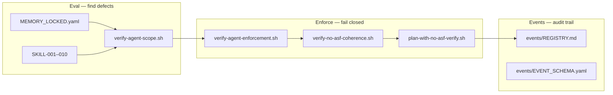

# Agentic enforcement map (LOCKED v1)

| Field | Value |
|-------|--------|
| Plane | `[DELIVERY]` — Noetfield cloud + local agents |
| Agent tag | `NF-CLOUD-AGENT` |
| Doc trace | `NF-CLOUD-OPS-002` |
| Updated | 2026-06-13 |
| Status | LOCKED — update via incident + memory bump |

---

## Purpose

Single map for **eval → enforce → event** agentic controls. Rules, skills, gates, and events are separate files; this doc routes agents and verify scripts.

**Industry parallel:** eval (find defects) → enforce (fail-closed gates) → re-eval (closed loop). See [AGENT_SELF_AUDIT_LOOP_LOCKED_v1.md](./AGENT_SELF_AUDIT_LOOP_LOCKED_v1.md) § Industry parallel.

---

## Eval → enforce chain



| Phase | Layer | Artifact | When |
|-------|-------|----------|------|
| **Eval** | Memory | `.cursor/agent-memory/MEMORY_LOCKED.yaml` | Every session start |
| **Eval** | Skills | `.cursor/skills/SKILL-001`–`010` | Before work, commit, session end |
| **Eval** | Scope gate | `./scripts/verify-agent-scope.sh` | Pre-commit (R-005) |
| **Enforce** | Enforcement gate | `./scripts/verify-agent-enforcement.sh` | Pre-push / PR (R-013) |
| **Enforce** | Coherence | `./scripts/verify-no-asf-coherence.sh` | Ship bundle |
| **Enforce** | Full bundle | `./scripts/plan-with-no-asf-verify.sh` | Ship / CI |
| **Event** | Session log | `.cursor/events/REGISTRY.md` | Session end or gate fail (R-012) |
| **Event** | Incidents | `.cursor/incidents/REGISTRY.md` | Boundary crossed (SKILL-004) |

---

## Rule precedence (R-010)

1. **Founder current message** (explicit bounded order)
2. **R-001–R-013** hard rules in `MEMORY_LOCKED.yaml`
3. **Open P0/P1 incidents**
4. **`execution_authority: false`** (advise only)
5. **Workflow bundles** (PLAN WITH NO ASF — after founder approves)
6. **Ship-first / plan.json** — never self-start

On conflict → **SKILL-007** before any disk edit.

---

## Hard rules index (MEMORY)

| ID | Summary | Skill / gate |
|----|---------|--------------|
| R-001 | Noetfield only | SKILL-001 |
| R-002 | Never commit ops/private or docs/internal | verify-agent-scope |
| R-003 | No payments/custody/PSP claims | PRODUCT_TRUTH |
| R-004 | Internal research ≠ mandate | SKILL-001 |
| R-005 | verify-agent-scope before commit | SKILL-002 |
| R-006 | Doc tagging on agent-written docs only | SKILL-005 |
| R-007 | No disk edits without permission | SKILL-006 |
| R-008 | Ask before acting | SKILL-006 |
| R-009 | SourceA block if mirror missing | verify-agent-scope |
| R-010 | Conflict resolution precedence | SKILL-007 |
| R-011 | Commercial outreach = agentic layer only | SKILL-008 |
| R-012 | File agent events at session end / gate fail | SKILL-010 |
| R-013 | verify-agent-enforcement before push/PR | verify-agent-enforcement |

---

## Skills map

| Skill | Role | Trigger |
|-------|------|---------|
| SKILL-001 | Scope gate | Session start, before edits |
| SKILL-002 | Pre-commit audit | Before `git commit` |
| SKILL-003 | Session end report | Before ending session |
| SKILL-004 | Incident filing | Boundary crossed |
| SKILL-005 | Doc tagging | New agent-written doc |
| SKILL-006 | Ask before implement | Default mode |
| SKILL-007 | Auto conflict resolution | Rule conflict |
| SKILL-008 | Agentic commercial boundary | Outreach / calls / CRM |
| SKILL-009 | Docs SSOT entry | New indexes / fragmented docs |
| SKILL-010 | Agentic event gate | Session end / verify / gate fail |

---

## Cursor rules (`.cursor/rules/`)

| Rule file | Binds |
|-----------|-------|
| `noetfield-scope.mdc` | R-001 company boundary |
| `noetfield-ask-before-edit.mdc` | R-007 / R-008 |
| `noetfield-rule-conflict-resolution.mdc` | R-010 / SKILL-007 |
| `noetfield-self-audit.mdc` | Loop + verify commands |
| `noetfield-ship-first.mdc` | Subordinate to R-007/R-010 |
| `noetfield-no-asf-plans.mdc` | PLAN WITH NO ASF bundle |
| `noetfield-read-order.mdc` | AGENT_READ_LINKS order |
| `noetfield-tracking.mdc` | AGENT_TRACKING priority |
| `noetfield-confidential-research.mdc` | docs/internal guard |
| `noetfield-ingest-yaml.mdc` | Post-ship ingest |
| `noetfield-prompt-os-reply.mdc` | cursor-reply format |

---

## Event types (lightweight)

Schema: [.cursor/events/EVENT_SCHEMA.yaml](../../.cursor/events/EVENT_SCHEMA.yaml)

| Type | When to file |
|------|--------------|
| `session_start` | After reading MEMORY + incidents |
| `scope_gate_pass` / `scope_gate_fail` | SKILL-001 result |
| `rule_conflict` | SKILL-007 invoked |
| `verify_run` | Any verify script (name + exit code) |
| `pre_commit` | SKILL-002 checklist complete |
| `session_end` | SKILL-003 report filed |
| `incident_filed` | SKILL-004 — link incident ID |

Registry: [.cursor/events/REGISTRY.md](../../.cursor/events/REGISTRY.md)

---

## Verify commands (agent)

```bash
# Pre-commit (R-005)
./scripts/verify-agent-scope.sh

# Pre-push / PR (R-013)
./scripts/verify-agent-enforcement.sh

# Full ship bundle
./scripts/plan-with-no-asf-verify.sh
```

---

## Related docs

| Doc | Role |
|-----|------|
| [AGENT_SELF_AUDIT_LOOP_LOCKED_v1.md](./AGENT_SELF_AUDIT_LOOP_LOCKED_v1.md) | Loop diagram + phases |
| [FOUNDER_AGENTIC_COMMERCIAL_AND_NO_CURSOR_AUTORUN_LOCKED_v1.md](./FOUNDER_AGENTIC_COMMERCIAL_AND_NO_CURSOR_AUTORUN_LOCKED_v1.md) | R-011 law |
| [DOCS_UNIFIED_MAP_LOCKED_v1.md](./DOCS_UNIFIED_MAP_LOCKED_v1.md) | Docs silo router |
| [AGENT_READ_LINKS_LOCKED_v1.md](./AGENT_READ_LINKS_LOCKED_v1.md) | Cloud agent entry |
