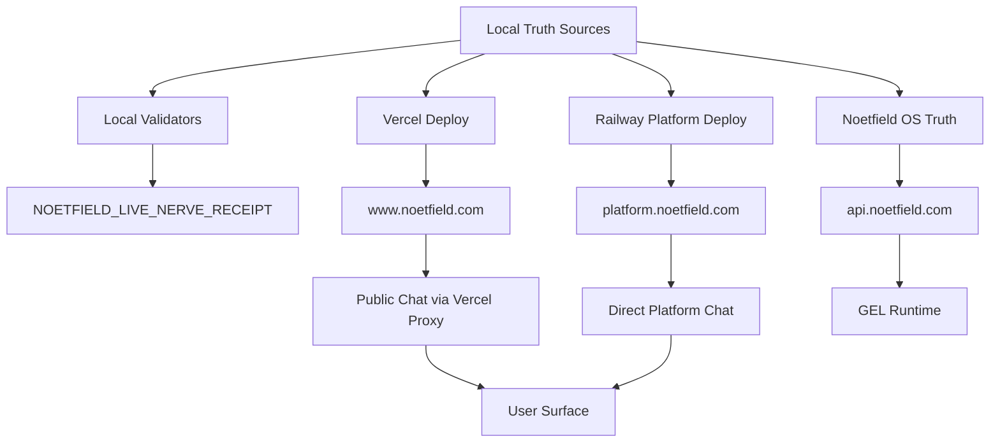

# Anti-Green-Theater Audit Report - Noetfield Live Mesh

## Executive Summary

Noetfield has real validators, live endpoints, manifests, and rules, but they are fragmented. The present system can show PASS while a stale or wrong live truth still exists on a sibling nerve.

The main proof:

- `www.noetfield.com/api/public/chat` returns the corrected executive overview because the Vercel proxy intercepts/guards it.
- `platform.noetfield.com/api/public/chat` still returns the stale executive overview directly.
- Local `noetfield_live_nerve.py --json` reports chatbot knowledge `chars=24035`, manifest version `NOETFIELD-CHATBOT-KNOWLEDGE-V1-p28-2026-06-29`, and `gate=PASS`.
- Production `platform.noetfield.com/api/public/chat/health` reports only `knowledge.chars=15838`, with no manifest hash/version exposed.
- Live production `www.noetfield.com` serves internal/private-looking artifacts (`ops/private`, `data/nf_*`, `railway.toml`) while local `verify-public-output-allowlist.py`, `verify-static-www`, and the local live nerve still pass.

This is green theater: local truth is greener than live platform truth, and the current green gates do not force semantic parity across `www`, `platform`, and `api`.

## System Map



## Live Probe Evidence

### Health Endpoints

| Endpoint | Status | Key Evidence | Audit Meaning |
|---|---:|---|---|
| `https://www.noetfield.com/health` | 200 | `service=noetfield-www` | www is live. |
| `https://www.noetfield.com/api/intake/health` | 200 | `delivery_mode=resend`, `platform_reachable=true` | www intake is configured. |
| `https://www.noetfield.com/api/public/chat/health` | 200 | `mode=platform-proxy`, `knowledge.chars=15838` | www depends on stale platform chat health. |
| `https://platform.noetfield.com/health` | 200 | `runtime=phase-3.1-backend-core`, `system_of_record=postgresql` | platform service is reachable. |
| `https://platform.noetfield.com/api/public/chat/health` | 200 | `knowledge.chars=15838` | platform does not expose local manifest parity. |
| `https://platform.noetfield.com/api/intake/health` | 200 | `ops_email_configured=false` | platform intake is not equivalent to www intake. |
| `https://api.noetfield.com/health` | 200 | `service=noetfeld-os`, policy hashes | GEL API is live. |
| `https://api.noetfield.com/readiness` | 200 | `ready=true`, `db_ok=true` | GEL readiness is live. |

### Golden Chat Parity

| Prompt | www Result | platform Result | Finding |
|---|---|---|---|
| `Executive overview` | Correct controlled reply; includes Copilot Pack, board PDF, procurement ZIP. | Stale reply: "governance execution infrastructure", "compliance log", "allow or deny". | P0 sibling endpoint truth leak. |
| `Trust Brief pricing` | Correct `$10,000`. | Correct `$10,000`. | Pass. |
| `GEL developer tools` | Says no GEL developer tools; weak against public GEL/dev truth. | Also weak, with stale infrastructure framing. | P1 developer lane regression. |
| `Investor diligence` | Says no public diligence materials, despite investor diligence route existing. | Stale infrastructure overview and missing investor route. | P1 investor lane regression. |
| `Do you store chat history?` | Says no chat history stored. | Same. | Potential policy conflict if telemetry is enabled; must be tied to actual telemetry health. |

## P0 Findings

### P0-0: Production Public Output Exposes Internal Artifacts While Local Gates Pass

Evidence confirmed on live `www.noetfield.com`:

- `GET /ops/private/sourceA/founder/repo-agent-notices/manifest.json` returns `200`.
- `GET /ops/private/agent-reference/NOETFIELD_AUTHORITY_REGISTRY.yaml` returns `200`.
- `GET /ops/private/agent-reference/intake/intake_log.jsonl` returns `200`.
- `GET /ops/private/sourceA/EXECUTION_TRUTH.json` returns `200`.
- `GET /data/nf_orient_routing_v1.json` returns `200`.
- `GET /data/nf_mono_nerve_wiring_v1.json` returns `200`.
- `GET /data/nf_anti_staleness_max_v1.json` returns `200`.
- `GET /railway.toml` returns `200`.

Current local contrast:

- `python3 scripts/verify-public-output-allowlist.py --json` reports `ok=true`, `blocked_count=0`.
- Local `.vercel/output/static` no longer contains those exact paths after the latest local output state check.
- `make verify-static-www` still passes.

Failure point:

The local generated output and the currently aliased production deployment are not proven equivalent. The local allowlist can pass while the live Vercel alias still serves older or unblocked artifacts.

Why existing green checks missed it:

- `verify-public-output-allowlist.py` scans local `.vercel/output/static`, not the live production alias.
- `verify-static-www.sh` is local/static and does not probe every forbidden live URL.
- `noetfield_live_nerve.py` trusts local output only, so `N1_PUBLIC_OUTPUT` can be green while production still serves internal artifacts.

Required future probe:

The public-output node must scan both the local generated artifact and the live production alias for:

- forbidden paths: `ops/`, all non-public `data/`, `railway.toml`, `var/`, `*.jsonl`, root lock/SSOT docs;
- forbidden content: `docs/ops`, `services/`, `SourceA`, `founder never`, `Hub approve`, private absolute paths, internal run commands;
- stale generated output: compare `.vercelignore`, `vercel.json`, and source timestamps/hashes against `.vercel/output/static`.
- live URL exposure: probe production URLs for every forbidden prefix and fail on any `2xx`.

### P0-1: Platform Chat Is Still Stale While www Is Masked

Evidence:

- `www` reply provider: `www-controlled-executive-overview`, stale=false.
- `platform` reply provider: `openrouter`, stale=true.
- Platform direct reply still uses stale "governance execution infrastructure / compliance log / allow or deny" positioning.

Failure point:

`api/public/chat/index.js` guards the public website, but `services/governance/noetfield_governance/public_chat.py` on production platform still uses stale deployed knowledge/prompt context.

Why existing green checks missed it:

- `verify-public-chat-truth.sh` validates local files and local Vercel handler behavior.
- `verify_platform_health.py` validates 2xx health, not answer semantics.
- `check_noetfield_com_e2e.py` tests `www`, not direct `platform` answer parity.

Required future probe:

```bash
POST https://www.noetfield.com/api/public/chat
POST https://platform.noetfield.com/api/public/chat
```

The same golden prompts must produce compatible answers, and direct platform must not rely on www proxy guards.

### P0-2: Live Nerve Receipt Is Local-Only

Evidence:

- `scripts/noetfield_live_nerve.py` nodes:
  - `N1_PUBLIC_OUTPUT`: scans `.vercel/output/static`.
  - `N2_CHAT_TRUTH`: checks local manifest/files.
  - `N3_DOC_FRESHNESS`: counts local public markdown.
- It does not call `www`, `platform`, or `api`.

Failure point:

`governance/NOETFIELD_LIVE_NERVE_RECEIPT.json` can say PASS while production platform remains stale.

Required future probe:

Add live nodes:

- `N4_WWW_LIVE_PARITY`
- `N5_PLATFORM_CHAT_SEMANTIC`
- `N6_PLATFORM_KNOWLEDGE_BUNDLE`
- `N7_GEL_LIVE_RUNTIME`
- `N8_DEPLOY_ALIAS_SHA`
- `N9_TELEMETRY_DURABILITY`

## P1 Findings

### P1-0: Generated Output Freshness Is Not Proven

Evidence:

- Local `.vercel/output/static` can differ from live production Vercel alias.
- Local source/output checks can pass while live URLs still return internal artifacts.
- `.vercelignore` and `vercel.json` contain blocks for internal surfaces, but production URL probes still return `200` for `ops/private`, `data/nf_*`, and `railway.toml`.

Failure point:

The system can update source rules while stale `.vercel/output/static` remains from an older build. Validators that scan stale output with an incomplete allowlist can still pass.

Required future probe:

Add an output freshness node that hashes or timestamps:

- source HTML/assets,
- `.vercelignore`,
- `vercel.json`,
- `scripts/rebuild-www-v6.py`,
- `.vercel/output/static`.

The live nerve should fail if generated output predates source/build-boundary changes.

### P1-1: Production Chat Health Does Not Expose Bundle Identity

Production platform health currently exposes:

```json
"knowledge": {
  "loaded": true,
  "chars": 15838,
  "pinned_chars": 5272
}
```

Local truth exposes:

```json
"knowledge_bundle_version": "NOETFIELD-CHATBOT-KNOWLEDGE-V1-p28-2026-06-29",
"manifest_hash": "c6ba9baa25af9efed74b2c126d974d539ecaa2584ffc3b4d261c9f493a51963e",
"chars": 24035
```

Failure point:

Production cannot prove it loaded the same manifest as local.

### P1-2: Database Knowledge Chunks Exist But Are Not Inference Truth

Evidence:

- Migration creates `knowledge_chunks` with `source_path`, `section_title`, `content`, `content_hash`.
- `scripts/sync_knowledge_chunks.py` inserts markdown sections into Postgres.
- `public_chat.py` calls `select_relevant_excerpt()`.
- `chatbot_knowledge.py` reads manifest markdown from disk; no `retrieve_chunks()` or DB query is used.
- `docs/ops/CHATBOT_KNOWLEDGE_UPGRADE_LOCKED_v1.md` explicitly says `knowledge_chunks` is synced but not read at inference.

Failure point:

Operators can say "database exists" while the live chatbot still answers from deployed markdown files.

### P1-3: Platform Smoke Is 2xx-Health, Not Semantic Truth

Evidence:

- `scripts/verify_platform_health.py` checks endpoint 2xx and prints JSON.
- `scripts/deploy_platform_smoke.sh` runs unit tests and health endpoints.
- It does not POST golden prompts to platform chat or compare platform answer to www.

Failure point:

Platform can be health-green while semantically stale.

### P1-4: Public Chat Telemetry Is Best-Effort And Not A Gate

Evidence:

- `public_chat_telemetry.py` catches exceptions and never breaks public chat.
- Platform health output in probes did not include telemetry details in the Vercel-proxied health response; direct platform health can expose telemetry only if deployed code/config supports it.

Failure point:

Failed/stale answers are not necessarily captured into a durable queue that blocks or alerts.

### P1-5: Intent Alignment Is Too Thin For Buyer-Critical Questions

Evidence:

- `public_chat_intelligence.py` required terms for `general_product` only include `Noetfield`.
- Investor intent requires `/investors/diligence/`, but live platform still failed investor diligence route in direct probe.
- Developer/GEL intent only requires `GEL`, allowing "No GEL developer tools" to pass weakly.

Failure point:

The classifier exists, but required/forbidden term sets are not strong enough to catch sellability failures.

### P1-6: www E2E Separates Platform/GEL Despite Runtime Dependency

Evidence:

- `check_noetfield_com_e2e.py` prints that platform and GEL are verified by dedicated smoke checks, not public www E2E.
- But the public chat path on www is `platform-proxy`, and `api/ecosystem/public` returns `chat_api_base=https://platform.noetfield.com`.

Failure point:

The website can depend on platform while the website E2E explicitly avoids proving platform semantic truth.

## P2 Findings

### P2-0: Public Markdown Allowlist Is Too Broad

Evidence:

- Public markdown prefixes include `docs/diligence/`, `docs/copilot/`, `docs/msp/`, `docs/trust-brief/`, and others.
- Generated public docs include internal-operational language such as `Hub approve`, `Founder never sends`, and links back to `OFFERINGS_LOCKED.md`.

Risk:

Files can be placed under an allowed public docs folder while still containing internal workflow, founder, or agent language.

Required future probe:

Each public markdown file needs explicit frontmatter/sensitivity:

```yaml
public: true
audience: buyer | partner | developer | investor
internal_terms_allowed: false
```

Folder allowlisting is not enough.

### P2-1: Deployment Docs Drift From Latest Production Reality

Evidence:

- `docs/ops/VERCEL_WWW_DEPLOY_LOCKED_v1.md` latest production deploy still cites an older 2026-06-26 deployment ID.
- A newer deploy happened during the incident fix, but the deploy doc was not refreshed.

Risk:

Agents can use old deploy IDs as current proof.

### P2-2: `ecosystem/public` Chat Base Conflicts With Earlier Same-Origin Rule

Evidence:

- `L0-law/PUBLIC_WWW_BRAND_E2E_LAW_LOCKED_v1.md` says `chat_api_base` stays same-origin until L3.
- Live `https://platform.noetfield.com/api/ecosystem/public` reports `chat_api_base=https://platform.noetfield.com`.
- Current widget on www still uses same-origin due host logic, but config truth is ambiguous.

Risk:

Future widget/config changes could bypass the Vercel guard and expose stale platform answers directly.

### P2-3: Telegram/Ecosystem Health Can Be `ok=true` While Telegram Is Not Ready

Evidence:

- `platform /api/ecosystem/health` returned `"ok": true`.
- Nested `telegram.ready=false`, `configured=false`.

Risk:

Aggregate health can hide lane-level not-ready states.

## Validator Truth Table

| Validator / Command | Type | What It Proves | What It Does Not Prove |
|---|---|---|---|
| `make verify-static-www` | Static/local | Public HTML markers, forbidden public leaks, local public chat truth script. | Production platform semantic truth; deploy parity. |
| `scripts/verify-public-chat-truth.sh` | Local semantic + local handler | Local files reject stale phrases; local Vercel handler returns controlled executive overview. | Direct production platform answer quality. |
| `scripts/noetfield_live_nerve.py --json` | Local receipt | Local public output allowlist, local manifest hash, local doc count. | Any live endpoint, Railway deploy, DB chunk freshness, whole-artifact content leaks not covered by allowlist. |
| `scripts/verify_platform_health.py` | Live health | Platform endpoints return 2xx. | Whether answers are current/correct. |
| `scripts/deploy_platform_smoke.sh` | Local tests + health | Unit tests and platform health. | Golden live answer parity and deployed manifest hash. |
| `scripts/check_noetfield_com_e2e.py` | Live www behavior | Public route status, blocked internal paths, one contextual chat POST via www. | Direct platform chat parity, GEL semantic alignment. |
| `make platform-sync-knowledge` | DB sync | Can insert local markdown into Postgres when `DATABASE_URL` exists. | That DB is used by inference or matches production. |
| `api.noetfield.com/health` + `/readiness` | GEL health | GEL service and policy readiness. | Whether website/platform claims map to current GEL product truth. |

## Live Parity Matrix

| Nerve | Local Claim | Live Observation | Gap |
|---|---|---|---|
| Public chat corpus | Manifest v2, 15 sources, 24k chars. | Platform health 15.8k chars, no version/hash. | Platform stale or not redeployed. |
| Public generated output | Local allowlist PASS; latest local output missing sampled leak paths. | Live `www` returns `200` for `ops/private`, `data/nf_*`, and `railway.toml`. | Production alias not proven equal to local output; live forbidden URL probes missing. |
| Executive overview | Local Vercel handler correct. | www correct, platform stale. | Masked stale direct platform endpoint. |
| Investor diligence | Local knowledge includes investor public context. | www says no public diligence; platform stale/missing investor. | Retrieval/lane forcing weak or stale deployment. |
| GEL developer | Local knowledge includes `gel-runtime.md` and `developer-tools.md`. | Both endpoints say no GEL developer tools. | Query/lane retrieval failure or stale platform. |
| Intake | www health email configured. | platform intake `ops_email_configured=false`. | Equivalent surfaces differ. |
| GEL runtime | NOOS PRODUCT_TRUTH says hosted/live. | `api.noetfield.com` health/readiness OK. | Live, but not tied into website/platform proof graph. |

## Root Cause Pattern

The system has rules and validators, but they are not a single graph. Each node proves its own narrow thing:

- Static website can be clean.
- Local manifest can be clean.
- Platform health can be 2xx.
- GEL can be ready.
- Docs can say sync rules exist.
- Generated output can contain internal artifacts while the allowlist still says PASS.

But no machine currently proves:

```text
local truth == deployed platform truth == www proxy behavior == GEL runtime truth
```

That is the anti-green-theater gap.

## Next-Phase Hardening Backlog

These are not implemented in this audit. They are the solution backlog after this report.

### H1: Expand Live Nerve To A Real Mesh

Extend `scripts/noetfield_live_nerve.py` beyond local checks:

- `N4_PUBLIC_OUTPUT_WHOLE_ARTIFACT`: full `.vercel/output/static` path + content leak scan.
- `N5_OUTPUT_FRESHNESS`: source/build-boundary hash compared to generated output.
- `N6_WWW_LIVE_CHAT`: golden prompts against `www`.
- `N7_PLATFORM_LIVE_CHAT`: same golden prompts against `platform`.
- `N8_CHAT_PARITY`: compare required/forbidden terms across both.
- `N9_PLATFORM_BUNDLE`: require production health to expose `knowledge_bundle_version`, `manifest_hash`, `manifest_violations`.
- `N10_DB_KNOWLEDGE`: report `knowledge_chunks` count, max updated_at, manifest hash, and whether inference uses DB.
- `N11_GEL_RUNTIME`: compare website/platform GEL claims to `api.noetfield.com/health` and `/readiness`.
- `N12_DEPLOY_ALIAS`: capture Vercel production deployment/alias and platform deploy identifier.

### H2: Add Live Golden Answer Eval

Create a golden question file with required and forbidden terms:

- Executive overview.
- Trust Brief pricing.
- Copilot Governance Pack.
- Investor diligence.
- GEL/developer tools.
- Privacy/history.
- Bank Pilot.
- Contact/RID.

Run against both `www` and `platform`.

### H3: Make Platform Chat Health Prove Bundle Identity

Platform `/api/public/chat/health` must expose:

- `knowledge_bundle_version`.
- `manifest_hash`.
- `manifest_violations`.
- `knowledge_files`.
- `distilled_at`.
- `source_count`.

### H4: Decide DB Truth Role

Either:

1. DB is not truth: remove claims that `knowledge_chunks` powers assistant behavior.
2. DB is truth: wire retrieval to DB and expose DB freshness/hash in health.

No middle state where DB exists but inference ignores it.

### H5: Stop Masking Platform Failures With www Guards

Vercel guards can protect users, but platform must also pass semantic golden tests. The guard should be reported as a degraded mode, not a fix.

### H6: Make Telemetry Actionable

Telemetry should produce:

- failed alignment queue,
- stale phrase hits,
- missing required term hits,
- latest event timestamp,
- retention path status,
- dashboard/report command,
- deploy-blocking threshold for P0 prompts.

### H7: Cross-Repo Truth Contract

The website repo and `noetfeld-os` need one read-only parity check:

- Read website ownership docs.
- Read NOOS `PRODUCT_TRUTH.md`.
- Probe `api.noetfield.com`.
- Compare public GEL/runtime claims to live health/readiness.

## Immediate P0 Follow-Up Recommendation

Before any new marketing copy or chatbot polish:

1. Redeploy or repair `platform.noetfield.com` public chat so direct platform answers pass the same golden prompts as www.
2. Add platform direct golden chat probes to the live nerve.
3. Expose manifest hash/version in production platform chat health.
4. Make local PASS invalid if platform bundle differs from local bundle.

Until then, the system is protected at `www` but not coherent.
