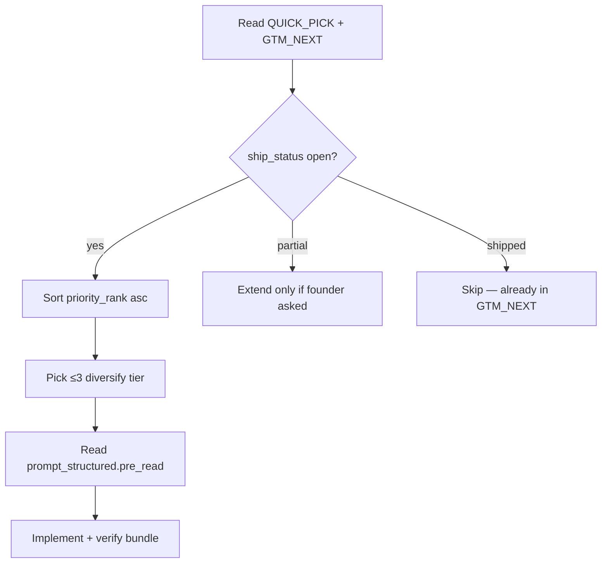

# Pick intelligence — unified 500 v3

**Status:** LOCKED pick logic · benchmark synthesis
**Regenerate:** `python3 scripts/generate_unified_prompt_pack_500.py`

## Executive rule

> Pick **proof that buyers can see in 5 minutes** before **engineering hygiene**.
> GTM validation is 2/10 until a board PDF is used in a real governance meeting.

## v3 scoring model (GTM + goal alignment)

| Signal | Weight | Why |
|--------|--------|-----|
| Success tier (S0–S8) | 0–100 base | Benchmark-aligned buyer outcome |
| Goal alignment | 0–100 | Locked goal keyword match (customer_1, tle_wedge, …) |
| Benchmark step | 1–10 | Maps to INSTITUTIONAL_BENCHMARK_10_STEP_PLAN |
| T1 vs T2/T3 | +12 / +5 | Revenue-critical path |
| Disk lane (A) | +10 | Ships buyer-visible artifact |
| Hub lane (H) | −20 | R-011 — not NF-CLOUD implement |
| `partial` status | ×0.35 | Extend only when slice already live |
| `shipped` status | 0 | Skip — log in GTM_NEXT instead |

**Inventory:** 440 open · 60 partial · 0 other

## Wise pick sequence (PLAN WITH NO ASF)

## Anti-patterns (never pick together)

| Bad combo | Why |
|-----------|-----|
| 3× S7 hardening | No buyer proof this iter |
| 2× S3 MSP + 1× S5 federal | Mixed ICP — confuses GTM story |
| S8 Hub + any disk task | R-011 boundary |
| Tier B connector + SSO | GTM 60-day lock |

## Suggested iter bundles

- **iter-1** (GTM 300): ship-fwd-097 · ship-fwd-081 · ship-fwd-062
- **iter-2** (GTM 294): ship-fwd-109 · ship-fwd-105 · ship-fwd-461
- **iter-3** (GTM 300): ship-fwd-124 · ship-fwd-103 · ship-fwd-060
- **iter-4** (GTM 300): ship-fwd-170 · ship-fwd-068 · ship-fwd-229
- **iter-5** (GTM 300): ship-fwd-260 · ship-fwd-289 · ship-fwd-220

## Structured prompt fields

Every plan in `unified_500_index.json` includes `prompt_structured`:

| Field | Purpose |
|-------|---------|
| `pre_read` | Locked docs to load before code |
| `success_when` | Definition of done |
| `stop_if` | Hard gates (R-001, R-011, ≤3 tasks) |
| `anti_scope` | Tier B/C / P9 deferrals |
| `pick_rationale` | Why this rank |
| `prompt_redesigned` | Full brainstorm-enriched agent brief |
| `benchmark_refs` | Reference vendors (Vanta, Inforcer, …) |
| `copy_wedge` | Buyer-facing pattern from benchmark |

## Related

- [PROMPT_PACK_EXECUTIVE_SYNTHESIS_v1.md](./PROMPT_PACK_EXECUTIVE_SYNTHESIS_v1.md)
- [SUCCESS_MODEL_TIERS_v1.md](./SUCCESS_MODEL_TIERS_v1.md)
- [UNIFIED_500_MASTER_v1.md](./UNIFIED_500_MASTER_v1.md)
- [QUICK_PICK.md](../no-asf/QUICK_PICK.md)
