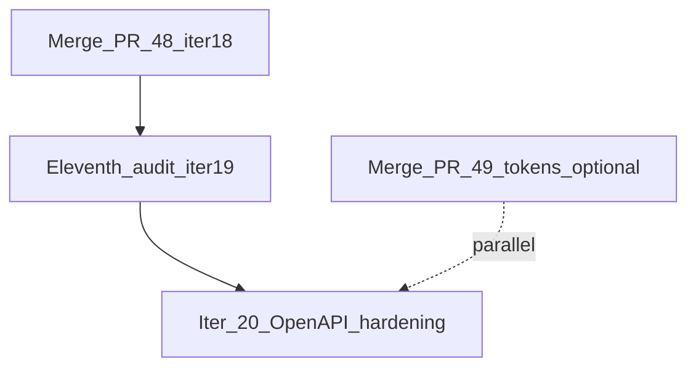

# PLAN WITH NO ASF — upgraded roadmap

**Agent tag:** `NF-CLOUD-AGENT`  
**Updated:** 2026-06-11  
**Authority:** [NOETFIELD_1000_PROMPT_PACK_LOCKED_v1.md](../../NOETFIELD_1000_PROMPT_PACK_LOCKED_v1.md) appendix · [GTM_NEXT.md](./GTM_NEXT.md)

When the founder says **PLAN WITH NO ASF** or **upgrade plans**, start here after [QUICK_PICK.md](./QUICK_PICK.md).

---

## Current truth (2026-06-11)

| Item | State |
|------|-------|
| `main` | @ `46a36a3` — ninth audit + iter 17 merged (PR #47) |
| Pending GTM ship | `cursor/eleventh-audit-iter19-37f0` — iter 18+19 bundle (supersedes PR #48) |
| Parallel product | [PR #49](https://github.com/kazemnezhadsina144-dot/Noetfield/pull/49) — design-token migration (not GTM merge rule) |
| Shipped on branch | **iter 18** (054–056) + **iter 19** (057–059) |
| Active queue | **iter 20** (060–062) — twelfth audit seed |
| Verify gate | `./scripts/plan-with-no-asf-verify.sh` |
| Agentic P0 | `ship-design-partner-outreach-026` — Hub only (R-011) |

---

## Implement order (founder `implement`)

| Step | Bundle | Branch pattern | PR |
|------|--------|----------------|-----|
| 1 | Tenth audit closeout — iter 18 on main | `cursor/tenth-audit-iter18-37f0` | #48 |
| 2 | Eleventh audit — iter 19 (057–059) | `cursor/eleventh-audit-iter19-37f0` | #50+ |
| 3 | Design tokens (optional parallel) | `cursor/design-token-migration-37f0` | #49 |
| 4 | Twelfth audit — iter 20 (060–062) | `cursor/twelfth-audit-iter20-37f0` | TBD |

---

## Eleventh audit — 10-phase (iter 19)

Bounded **≤3** ship tasks from [GTM_NEXT.md](./GTM_NEXT.md):

| ID | Outcome | Primary evidence |
|----|---------|------------------|
| **057** `ship-procurement-openapi-verify-057` | `/openapi.json` returns 200 in gtm-ops bundle | `scripts/verify-gtm-ops-docs.sh` |
| **058** `ship-services-governance-readme-openapi-058` | README `/openapi.json` cite enforced by verify | `services/governance/README.md` |
| **059** `ship-tenth-audit-merge-rule-059` | Tenth-audit closeout template in manifest | `ENGINEERING_DONE_MANIFEST.md` |

### Phases

1. Merge PR #48 → reconcile OPEN_PRS, COMPLETED_ON_MAIN, SHIP_NOW  
2. Post-merge truth @ new `main` SHA  
3. Branch `cursor/eleventh-audit-iter19-37f0` + merge rule + `gh` regex  
4. `plan.json` 057–059 `done` at ship  
5. Ship 057 — OpenAPI 200 in gtm-ops verify  
6. Ship 058 — README + procurement parity guards  
7. Ship 059 — audit closeout template + tenth-audit manifest rows  
8. SHIP_DONE_MAP 057–059 + manifest iter 19  
9. SourceA status + founder #2/#7/026 fence  
10. Sync, verify PASS, iter 20 seed, cursor-reply closeout, PR  

---

## Forward queue — iter 20 (twelfth audit seed)

Activate after iter 19 ships:

| ID | Outcome |
|----|---------|
| **060** `ship-governance-readme-www-060` | `/services/governance/README.md` returns 200 on :13080 |
| **061** `ship-api-status-openapi-field-061` | `GET /api/status` JSON includes `"openapi": "/openapi.json"` |
| **062** `ship-eleventh-audit-merge-rule-062` | Eleventh-audit branch in manifest closeout template |

---

## Forward queue — iter 21–22 (preview)

_Not in verify mirror until prior iter ships._

### Iter 21 — design-system parity

| ID | Outcome |
|----|---------|
| **063** `ship-design-token-verify-063` | Verify script asserts governance-console imports `noetfield-tokens.css` |
| **064** `ship-openapi-schema-content-064` | gtm-ops verify: openapi.json body contains `"openapi"` key |
| **065** `ship-procurement-readme-parity-065` | Procurement + README cross-link verify (buyer path parity) |

### Iter 22 — audit cadence + ops

| ID | Outcome |
|----|---------|
| **066** `ship-twelfth-audit-merge-rule-066` | Twelfth-audit branch documented in manifest template |
| **067** `ship-dev-dashboard-rebuild-hint-067` | verify-ui-e2e FAIL message cites `NF_DEV_FORCE_DASHBOARD_BUILD=1` |
| **068** `ship-plan-roadmap-coherence-068` | Coherence verify references PLAN_ROADMAP iter mirror |

---

## Parallel tracks (outside GTM ship merge rule)

| Track | PR | Notes |
|-------|-----|-------|
| Design token migration | #49 | Governance-console → shared tokens; merge after or with iter 19 |
| TrustField scope | #7 | **Close** — out of scope (R-001) |
| Agentic outreach 026 | Hub | Not NF-CLOUD disk |

---

## Audit naming convention

| Audit | Iter | Branch | Ship IDs |
|-------|------|--------|----------|
| Sixth | 14 | `cursor/sixth-audit-iter14-37f0` | 042–044 |
| Seventh | 15 | `cursor/seventh-audit-iter15-37f0` | 045–047 |
| Eighth | 16 | `cursor/eighth-audit-iter16-37f0` | 048–050 |
| Ninth | 17 | `cursor/ninth-audit-iter17-37f0` | 051–053 |
| Tenth | 18 | `cursor/tenth-audit-iter18-37f0` | 054–056 |
| **Eleventh** | **19** | `cursor/eleventh-audit-iter19-37f0` | **057–059** |
| Twelfth | 20 | `cursor/twelfth-audit-iter20-37f0` | 060–062 |

---

## Founder checklist

- [ ] Merge PR #48 (tenth audit / iter 18)  
- [ ] `implement` eleventh audit (iter 19)  
- [ ] Merge PR #49 (design tokens) when ready  
- [ ] Close PR #7 (TrustField)  
- [ ] Agentic 026 outreach on Hub  
- [ ] SourceA sync on Mac  

---

## Related

- [GTM_NEXT.md](./GTM_NEXT.md) — active Tier A queue  
- [QUICK_PICK.md](./QUICK_PICK.md) — top-3 mirror for verify  
- [OPEN_PRS.md](./OPEN_PRS.md) — merge policy + pending rows  
- [os/SHIP_NOW.md](../../../../os/SHIP_NOW.md) — ship mandate  
