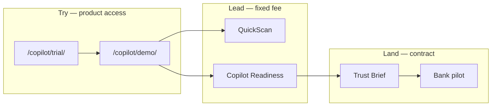

<!-- ADVISOR_ARCHITECT_CHECKLIST_STUB (auto-inserted) -->
Advisor / Architect Minimal Checklist (AUTO-STUB)
-----------------------------------------------

- protects: Which founder goal does this protect? (pick one)
- sina_workload: reduces / increases + short rationale
- permission_loop: yes / no + explanation
- sandbox_autonomy: yes / no + where/how (sandbox lane path)
- target_to_blocker: yes / no + mitigation
- canon_version: (string)
- sandbox_evidence: link(s) to sandbox receipt(s)

# Commercial agentic UI reference (v1)

**Purpose:** Translate Google’s high-agentic system patterns into Noetfield’s institutional www — without copying vendor UI or claiming Google partnership.

**Audience:** Product, design, and engineering building `/copilot/demo/`, `/copilot/trial/`, and future `platform.noetfield.com` console.

---

## Google reference stack (what to learn from)

| Layer | Google / open ecosystem | What it teaches | Official links |
|-------|-------------------------|-----------------|----------------|
| **Agent runtime** | [Agent Development Kit (ADK)](https://adk.dev/) | Multi-agent orchestration, local debug, step-by-step event inspection, deploy to Cloud Run/GKE | [Google Developers Blog — ADK](https://developers.googleblog.com/en/agent-development-kit-easy-to-build-multi-agent-applications/) |
| **Agent ↔ UI protocol** | [AG-UI](https://docs.ag-ui.com/) | Streaming, bi-directional state, human-in-the-loop, frontend tools | [ADK + AG-UI blog](https://developers.googleblog.com/en/delight-users-by-combining-adk-agents-with-fancy-frontends-using-ag-ui/) |
| **Generative UI catalog** | [A2UI](https://a2ui.org/) | Agents render **approved component catalogs** only — no arbitrary HTML (sandbox security) | [A2UI catalogs](https://a2ui.org/concepts/catalogs/) |
| **Interactive learning** | [AG-UI Dojo](https://dojo.ag-ui.com) | Sandbox for generative UI, shared state, HITL patterns | CopilotKit ADK integration docs |
| **Enterprise shell** | Gemini Enterprise + A2UI | Native rendering of agent-emitted surfaces in a trusted container | [Medium — ADK + A2UI deep dive](https://medium.com/google-cloud/building-native-conversational-uis-on-google-cloud-a-deep-dive-into-adk-a2ui-and-gemini-b4d9c5578bcd) |

### Patterns worth adopting (mapped to Noetfield)

| Google pattern | Noetfield equivalent | Public surface |
|----------------|---------------------|----------------|
| ADK Web UI event trace | Evaluate → graph → policy → approval → export timeline | `/copilot/demo/` |
| AG-UI shared state | Request ID (RID) threads intake, status, exports | Footer + all `[data-rid-link]` |
| Human-in-the-loop | Named approver on TLE; high-risk = human sign-off | Demo step 3, TLE samples |
| A2UI component catalog | `nf26-*` + locked shell buttons/cards/badges only | All institutional pages |
| Sandbox before buy | Developer trial (mock M365, capped evaluates) | `/copilot/trial/` |
| Commercial upgrade path | Published SKUs with fixed scope | `/gate/sales/` |

### Patterns we do **not** adopt on www

- Arbitrary agent-generated HTML/JS (XSS / prompt-injection UI risk — A2UI exists to prevent this)
- Loot-box, dark-pattern engagement, or manipulative urgency timers
- Payment/custody sandbox copy (legacy `/login/`, `/kits/` — retired from nav, decommission target)
- Fourth retail SKU or MSB orchestration framing

---

## Gaming-style commercial agentic (ethical adoption)

High-converting **game and platform** products use progress loops — we adopt the **mechanics**, not manipulation, for governance proof.

| Source | Pattern | Noetfield use | Avoid |
|--------|---------|---------------|-------|
| **Google AI Studio / Vertex** | Free sandbox quota → paid project | Trial: 50 evaluates → Readiness SKU | Fake scarcity |
| **ADK Web UI** | Run trace → inspect events → replay | Demo stepper unlocks event rows | Infinite scroll noise |
| **Xbox / Play Pass** | Try library → subscribe for full | Demo → trial → Sales catalog | Hidden cancel traps |
| **Duolingo-style loops** | Session complete + progress ring | Demo completion % → CTA unlock | Streak punishment |
| **AG-UI Dojo** | Interactive sandbox lessons | `/copilot/demo/` click-through proof | Gamified paywalls |
| **Mobile F2P (ethical)** | Achievement on milestone | “Export unlocked” badge at step 5 | Loot boxes |

### Institutional gaming UI primitives (added to catalog)

| Primitive | CSS class | Use |
|-----------|-----------|-----|
| Progress ring | `nf26-progressRing` | Demo session completion |
| Achievement badge | `nf26-achievement` | Milestone unlock (e.g. export ready) |
| XP strip | `nf26-xpStrip` | Step progress toward commercial CTA |

**Rule:** Progress celebrates **governance proof completed**, not time-on-site. Every loop ends at a **published SKU** or honest “out of scope.”

---

## Noetfield commercial agentic UX model

**Spine (every tier):** evaluate → decide → record → export.

**Canada institutional tune:** Vancouver BC · PIPEDA-aligned intake · OSFI-orientation badges on regulated pages · non-custodial boundary on every CTA.

---

## UI component catalog (A2UI-style lock)

Agents and demos may only emit surfaces built from this catalog on public www:

| Primitive | CSS class | Use |
|-----------|-----------|-----|
| Hero shell | `nf26-heroShell` | SKU landing |
| Path step | `nf26-pathStep` | Commercial upgrade ladder |
| Spine step | `nf26-spineStep` | Evaluate → export |
| Event row | `nf26-eventRow` | ADK-style trace |
| Sandbox meter | `nf26-sandboxMeter` | Trial limits (evaluates remaining) |
| Catalog tile | `nf26-surface` | Self-serve proof links |
| Badge | `nf26-badge` | Available / Planned / Out of scope |
| HITL gate | `nf26-hitlGate` | Approver required callout |

---

## E2E commercial polish checklist

- [x] `/copilot/demo/` — 5-minute interactive proof (stepper + sample TLE JSON + progress ring)
- [x] `/copilot/trial/` — sandbox orientation, limits, upgrade CTAs
- [x] Header Try → Demo + Trial
- [x] Homepage + `/copilot/` + `/gate/sales/` cross-links
- [x] `verify-commercial-agentic.sh` passes
- [x] No legacy fintech sandbox in indexed nav
- [x] Three contract SKUs only on all commercial pages
- [x] Footer Try links (demo/trial)
- [ ] Live runtime on `platform.noetfield.com` (future)
---

## Backend bridge (future platform subdomain)

| www (institutional) | platform.noetfield.com (runtime) |
|---------------------|----------------------------------|
| Demo walkthrough (orientation) | `POST /use-cases/copilot-governance/demo` |
| Trial signup CTA | Workspace + mock M365 connectors |
| TLE samples (static YAML) | Live evaluate API + export verify |

See `docs/PHASE_3_5_COPILOT_DEMO_PACKAGE.md` for backend demo narrative.

---

## Further reading

- [Google Cloud ADK docs](https://docs.cloud.google.com/gemini-enterprise-agent-platform/build/adk)
- [ADK AG-UI integration](https://github.com/google/adk-docs/blob/main/docs/integrations/ag-ui.md)
- [A2UI authoring components](https://a2ui.org/guides/authoring-components/)
- [CopilotKit — Agentic Generative UI](https://docs.copilotkit.ai/adk/generative-ui/agentic)
- [Noetfield PLATFORM_BLUEPRINT.md](../../PLATFORM_BLUEPRINT.md) §4.2 Copilot wedge
- [Noetfield OFFERINGS.md](../../OFFERINGS.md) — three SKUs only
